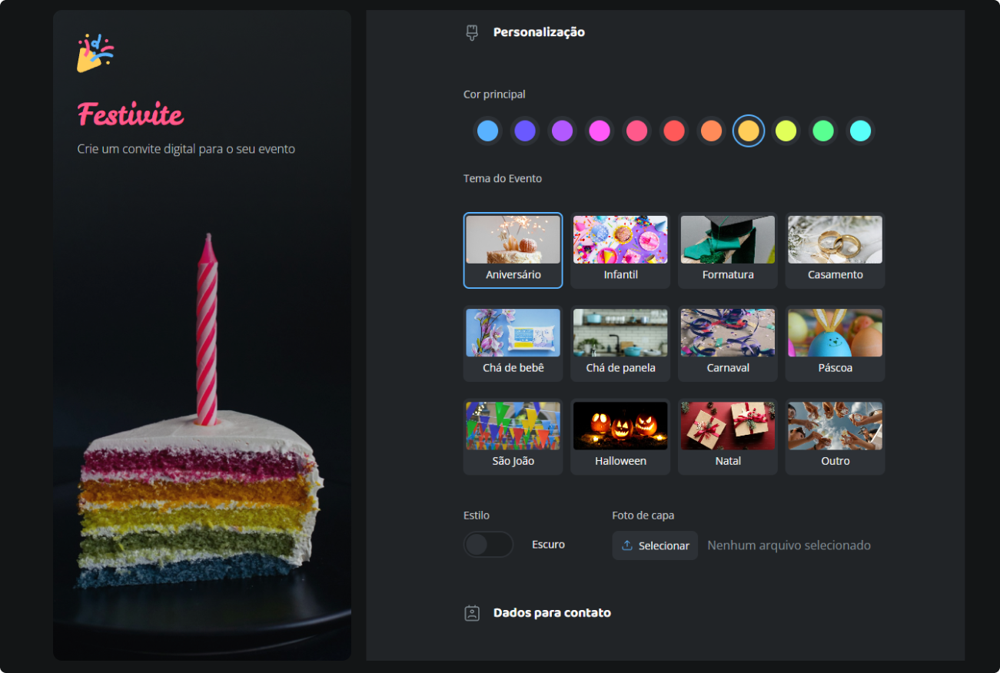

# Formulário de Convite de Aniversário

    

## Projeto
> Formação FullStack

No segundo desafio do módulo 4, trabalhei com formulários desenvolvendo um projeto de convite de aniversário. Apliquei tudo que aprendi até agora e dei um foco especial nos elementos de formulário.

Nessa aplicação, mexi com:

- Formulários HTML
- Input de texto
- Estilização de inputs com CSS
- Input de data
- Radio
- Estilização de formulários com CSS

## 🛠️ Tecnologias utilizadas

- HTML
- CSS